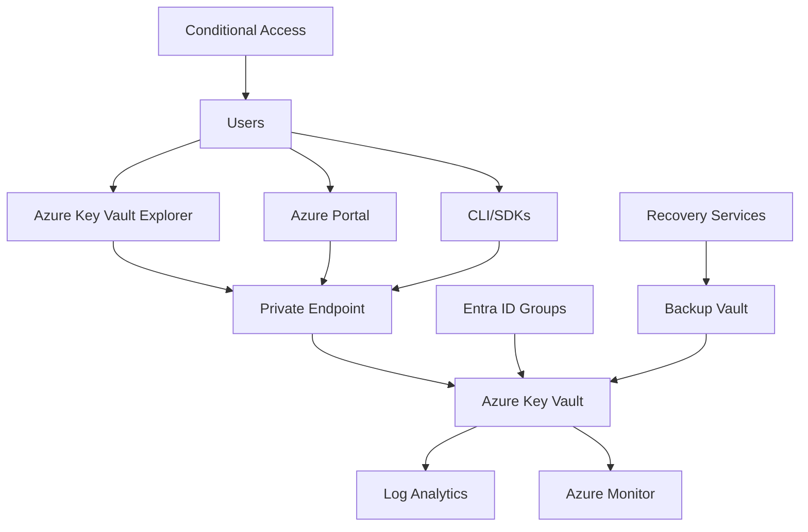

# Architecture & Design

## High-Level Architecture



## Core Components

### 1. Azure Key Vault Instance

- **Name Pattern**: `{company}-{environment}-{purpose}`
- **Example**: `contoso-prod-secrets`, `contoso-dev-keys`
- **Configuration**: RBAC mode, purge protection enabled, soft delete enabled

### 2. Network Security

- **Private Endpoint**: All access through private network
- **Firewall Rules**: Restrict to specific IP ranges/networks
- **DNS Configuration**: Private DNS zones for vault resolution

### 3. Identity & Access

- **Authentication**: Microsoft Entra ID (Azure AD)
- **Authorization**: Azure RBAC (data-plane)
- **MFA**: Enforced via Conditional Access policies

### 4. Monitoring & Logging

- **Diagnostic Logs**: All operations logged to Log Analytics
- **Activity Logs**: 1-year retention
- **Alerts**: Real-time monitoring for security events

## Design Patterns

### Naming Conventions

#### Secret Naming

```
{team}/{system}/{purpose}[/{environment}]
```

**Examples:**

- `data/etl/database/password/prod`
- `web/api/external-service/key/dev`
- `mobile/app/push-notification/cert/prod`

#### Key Naming

```
keys/{team}/{system}/{purpose}[/{environment}]
```

**Examples:**

- `keys/bi/reporting/tenant-signing/prod`
- `keys/payment/processor/encryption/dev`

### Tagging Strategy

#### Required Tags

- `team`: Owning team
- `environment`: dev/staging/prod
- `owner`: UPN of responsible person
- `ticket`: Related ticket/request ID
- `pii`: Contains PII (yes/no)
- `decommission_date`: When to remove

#### Optional Tags

- `project`: Associated project
- `cost_center`: Financial tracking
- `compliance`: Compliance requirements
- `rotation_schedule`: Rotation frequency

### Lifecycle Management

#### Default Policies

- **Secrets**: 180-day expiry, 30-day warning
- **Keys**: 12-month rotation, 60-day warning
- **Certificates**: 90-day expiry, 30-day warning

#### Rotation Procedures

1. **Automated**: Where possible using Azure Functions
2. **Semi-automated**: Scripted with manual approval
3. **Manual**: For complex or sensitive items

## Network Architecture

### Private Endpoint Configuration

```bash
# Private endpoint configuration
az network private-endpoint create \
  --name "kv-pe-{company}-{env}" \
  --resource-group "{rg}" \
  --vnet-name "{vnet}" \
  --subnet "{subnet}" \
  --private-connection-resource-id $(az keyvault show --name "{vault-name}" --query id -o tsv) \
  --group-id vault \
  --connection-name "kv-connection"
```

### DNS Configuration

- Private DNS zones for vault resolution
- Custom DNS entries for internal access
- Fallback to public DNS when needed

## Integration Patterns

### Application Integration

#### .NET Example

```csharp
using Azure.Identity;
using Azure.Security.KeyVault.Secrets;

var client = new SecretClient(
    new Uri("https://{vault-name}.vault.azure.net/"),
    new DefaultAzureCredential()
);

var secret = await client.GetSecretAsync("my-secret");
```

#### Python Example

```python
from azure.identity import DefaultAzureCredential
from azure.keyvault.secrets import SecretClient

credential = DefaultAzureCredential()
client = SecretClient(vault_url="https://{vault-name}.vault.azure.net/", credential=credential)

secret = client.get_secret("my-secret")
```

#### PowerShell Example

```powershell
# Get secret
$secret = Get-AzKeyVaultSecret -VaultName "{vault-name}" -Name "my-secret"

# Use in application
$connectionString = $secret.SecretValueText
```

## Scalability Considerations

### Performance

- Vault SKU selection (Standard vs Premium)
- Request throttling and limits
- Caching strategies for frequently accessed secrets

### High Availability

- Multi-region deployment for critical workloads
- Backup and disaster recovery procedures
- Failover mechanisms

### Cost Optimization

- Right-sizing vault instances
- Lifecycle management for unused secrets
- Monitoring and alerting on costs

## Security Architecture

### Zero Trust Principles

- Never trust, always verify
- Least privilege access
- Continuous monitoring
- Defense in depth

### Compliance Framework

- SOC2 Type II
- GDPR compliance
- Industry-specific requirements
- Regular audit procedures

## Disaster Recovery

### Backup Strategy

- Automated daily backups
- Immutable backup storage
- Cross-region replication
- Regular restore testing

### Recovery Procedures

- RTO: 4 hours for critical secrets
- RPO: 24 hours maximum
- Automated failover for critical systems
- Manual procedures for non-critical systems
