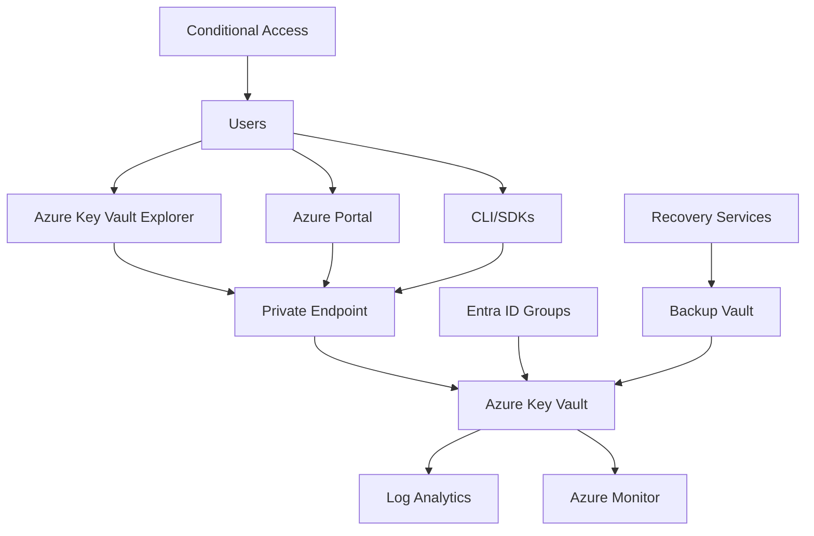

# Azure Key Vault Implementation Guide

A comprehensive, enterprise-ready implementation guide for Azure Key Vault with security best practices, operational procedures, and user training materials.

## 🚀 Quick Start

Get up and running in 15 minutes with our [Quick Start Guide](docs/quick-start-guide.md).

## 📚 Documentation Structure

| Document                                       | Description                                |
| ---------------------------------------------- | ------------------------------------------ |
| [Quick Start Guide](docs/quick-start-guide.md) | 15-minute setup guide                      |
| [Architecture & Design](docs/architecture.md)  | Technical architecture and design patterns |
| [Security Framework](docs/security.md)         | Security controls and best practices       |
| [Implementation Guide](docs/implementation.md) | Detailed implementation steps              |
| [Operational Procedures](docs/operations.md)   | Daily, weekly, and monthly procedures      |
| [User Training](docs/user-training.md)         | End-user training materials                |
| [CLI Reference](docs/cli-reference.md)         | Complete CLI command reference             |
| [Troubleshooting](docs/troubleshooting.md)     | Common issues and solutions                |

## 🛠️ Tools & Scripts

| Tool                                        | Description                      |
| ------------------------------------------- | -------------------------------- |
| [Setup Script](scripts/setup-keyvault.ps1)  | Automated Key Vault deployment   |
| [Audit Script](scripts/audit-access.ps1)    | Access auditing and reporting    |
| [ARM Template](templates/arm-template.json) | Infrastructure as Code template  |
| [Examples](examples/)                       | Practical examples and templates |

## 📋 Implementation Checklist

Use our [Implementation Checklist](IMPLEMENTATION_CHECKLIST.md) to ensure a complete and secure deployment.

## 🎯 Key Features

- **Enterprise Security**: RBAC, private endpoints, and comprehensive monitoring
- **Operational Excellence**: Automated procedures and audit capabilities
- **User-Friendly**: Complete training materials and user guides
- **Compliance Ready**: Built-in compliance and audit features
- **Scalable**: Designed for organizations of all sizes

## 🏗️ Architecture Overview

## 🔐 Security Highlights

- **Zero Trust Architecture**: Private endpoints and network restrictions
- **RBAC-Based Access**: Group-based permissions with least privilege
- **Comprehensive Auditing**: All operations logged and monitored
- **Data Protection**: Encryption at rest and in transit
- **Compliance Ready**: SOC2, GDPR, and industry standard compliance

## 📊 Monitoring & Alerting

- Real-time security alerts
- Access pattern analysis
- Performance monitoring
- Compliance reporting
- Automated audit trails

## 🚀 Getting Started

1. **Review Architecture**: Start with [Architecture & Design](docs/architecture.md)
2. **Plan Security**: Review [Security Framework](docs/security.md)
3. **Quick Setup**: Follow [Quick Start Guide](docs/quick-start-guide.md)
4. **Full Implementation**: Use [Implementation Guide](docs/implementation.md)
5. **Train Users**: Deploy [User Training](docs/user-training.md)

## 📞 Support

- **IT Service Desk**: <it-servicedesk@company.com>
- **Platform Team**: <platform-team@company.com>
- **Security Team**: <security-team@company.com>

## 📄 License

This guide is provided as-is for internal use. Please ensure compliance with your organization's policies and Azure terms of service.
