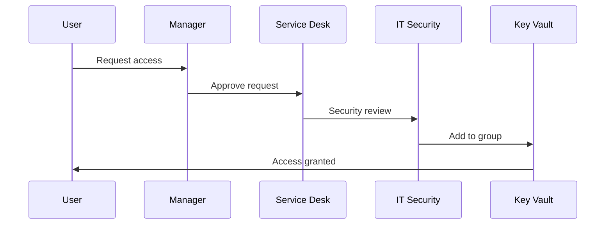

# Security Framework

## Security Controls

### 1. Network Security

```bash
# Private endpoint configuration
az network private-endpoint create \
  --name "kv-pe-{company}-{env}" \
  --resource-group "{rg}" \
  --vnet-name "{vnet}" \
  --subnet "{subnet}" \
  --private-connection-resource-id $(az keyvault show --name "{vault-name}" --query id -o tsv) \
  --group-id vault \
  --connection-name "kv-connection"
```

### 2. Access Policies

- **Principle of Least Privilege**: Users get minimum required permissions
- **Group-Based Access**: All access through Entra ID groups
- **Regular Reviews**: Quarterly access recertification

### 3. Data Protection

- **Encryption at Rest**: Azure-managed keys (default)
- **Encryption in Transit**: TLS 1.2+
- **Export Restrictions**: Keys marked as non-exportable

### 4. Compliance

- **Audit Logging**: All operations logged and monitored
- **Retention Policies**: Configurable based on compliance requirements
- **Backup & Recovery**: Immutable backups with defined retention

## Security Best Practices

1. **Never store secrets in code repositories**
2. **Use Managed Identity for applications when possible**
3. **Implement secret rotation policies**
4. **Monitor and alert on unusual access patterns**
5. **Regular security assessments and penetration testing**

## RBAC & Access Management

### Role Definitions

| Role                          | Permissions                    | Use Case                       | Assignment      |
| ----------------------------- | ------------------------------ | ------------------------------ | --------------- |
| **Key Vault Administrator**   | Full management including RBAC | Platform team, security team   | Few individuals |
| **Key Vault Reader**          | Read metadata only             | Auditors, compliance team      | As needed       |
| **Key Vault Secrets User**    | Get/List secrets               | Application developers         | Team groups     |
| **Key Vault Secrets Officer** | Manage secrets lifecycle       | Team leads, security officers  | Team groups     |
| **Key Vault Crypto User**     | Use keys for crypto operations | Developers, applications       | Team groups     |
| **Key Vault Crypto Officer**  | Manage keys lifecycle          | Security team, crypto officers | Few individuals |

### Group Structure

#### Naming Convention

```markdown
GG-AKV-{Environment}-{Role}-{Team}
```

#### Examples

- `GG-AKV-PROD-ADMINS-PLATFORM`
- `GG-AKV-DEV-SECRETS-USERS-DATA`
- `GG-AKV-PROD-CRYPTO-OFFICERS-SECURITY`

### Access Request Workflow

#### 1. Request Process



#### 2. Request Template

```markdown
Subject: AKV Access Request - {Team} - {Resource} - {Name}

Details:

- Team: {Team Name}
- Resource: {Secret/Key Name}
- Permission Level: {User/Officer/Admin}
- Justification: {Business Need}
- Duration: {Permanent/Temporary with end date}
- Manager Approval: {Attached/Reference}
- Security Review Required: {Yes/No}
```

## Monitoring & Alerting

### Key Metrics

#### Security Metrics

- Failed authentication attempts
- Unusual access patterns
- Privilege escalation attempts
- Secret access outside business hours

#### Operational Metrics

- Secret retrieval frequency
- Error rates
- Performance metrics
- Backup success rates

### Alert Rules

#### Critical Alerts

```kusto
// Failed authentication attempts
AzureDiagnostics
| where ResourceProvider == "MICROSOFT.KEYVAULT"
| where OperationName == "Authentication"
| where ResultType == "Failure"
| where TimeGenerated > ago(1h)
| summarize count() by CallerIPAddress, bin(TimeGenerated, 5m)
| where count_ > 10
```

#### Warning Alerts

```kusto
// Secrets expiring soon
AzureDiagnostics
| where ResourceProvider == "MICROSOFT.KEYVAULT"
| where OperationName == "SecretGet"
| where TimeGenerated > ago(24h)
| summarize count() by SecretName
| where count_ == 0
```

### Dashboard Configuration

#### Executive Dashboard

- Total secrets managed
- Access request trends
- Security incident summary
- Compliance status

#### Operational Dashboard

- Real-time access metrics
- Error rates and trends
- Performance indicators
- Alert status

## Compliance Framework

### Regulatory Requirements

- **SOC2 Type II**: Security, availability, processing integrity
- **GDPR**: Data protection and privacy
- **HIPAA**: Healthcare data protection (if applicable)
- **PCI DSS**: Payment card data security (if applicable)

### Audit Procedures

- **Quarterly Access Reviews**: Recertify all access
- **Annual Security Assessments**: Comprehensive security review
- **Incident Response**: Documented procedures for security incidents
- **Compliance Reporting**: Regular reports to stakeholders

### Data Classification

- **Public**: No restrictions
- **Internal**: Company use only
- **Confidential**: Restricted access
- **Secret**: Highly restricted access

## Incident Response

### Security Incident Types

1. **Unauthorized Access**: Suspicious access patterns
2. **Data Breach**: Potential exposure of secrets
3. **Privilege Escalation**: Unauthorized permission changes
4. **System Compromise**: Vault security compromise

### Response Procedures

1. **Immediate Response**:
   - Isolate affected systems
   - Preserve evidence
   - Notify security team

2. **Investigation**:
   - Analyze logs and access patterns
   - Identify scope of impact
   - Document findings

3. **Recovery**:
   - Rotate compromised secrets
   - Update access controls
   - Implement additional safeguards

4. **Post-Incident**:
   - Conduct lessons learned
   - Update procedures
   - Improve monitoring

## Security Training

### User Training Topics

- Password security best practices
- Phishing awareness
- Secure secret handling
- Incident reporting procedures

### Administrator Training Topics

- Advanced security configurations
- Threat detection and response
- Compliance requirements
- Audit procedures

### Regular Updates

- Quarterly security briefings
- Annual comprehensive training
- Ad-hoc training for new threats
- Continuous awareness programs
